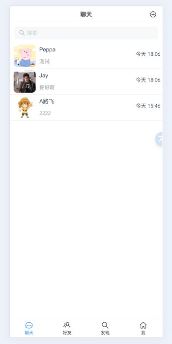
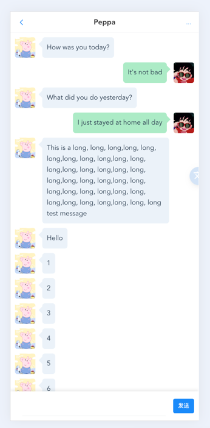
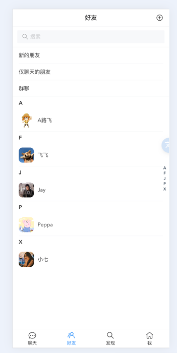
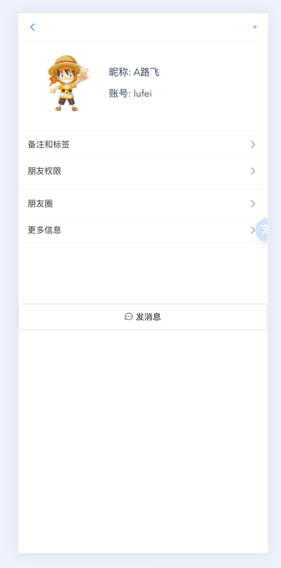
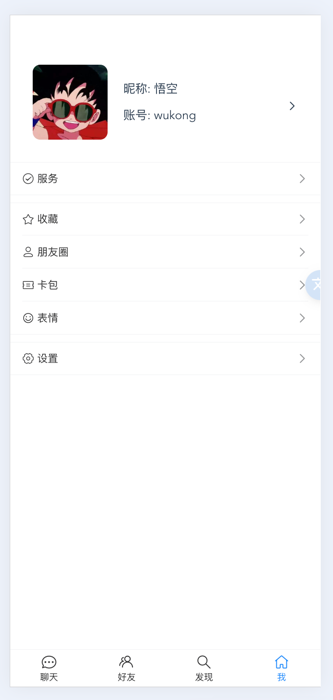

# IM 演示

[中文说明](./README-zh.md) | [English](./README.md)

这是一个使用WebSocket技术的前端IM APP代码仓库

### 在线体验地址 

记得F12调成移动端模式

http://chat.charmcode.cn/


### 技术栈
- Vue3
- TypeScript
- Pinia
- VantUI
- axios
- Docker + nginx


### 后端仓库地址

[IM-Gin](https://github.com/wxy2077/net_chat)

### 计划待开发功能

- [ ] 群组消息
- [ ] WebRtc 视频聊天

### UI 截图

<details>
<summary>点击展开</summary>

  

 

</details>

## Project Setup

```sh
npm install
```

### Compile and Hot-Reload for Development

```sh
npm run dev
```

### Type-Check, Compile and Minify for Production

```sh
npm run build
```

### Run Unit Tests with [Vitest](https://vitest.dev/)

```sh
npm run test:unit
```

### Lint with [ESLint](https://eslint.org/)

```sh
npm run lint
```
