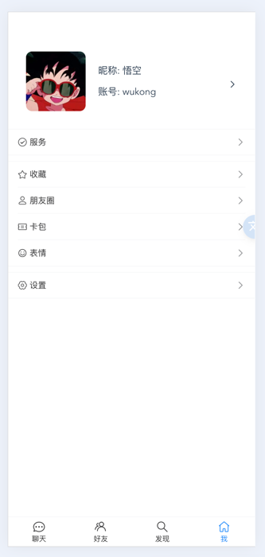

# IM demo

[中文说明](./README-zh.md) | [English](./README.md)

This is an IM APP front-end code repository, using WebSocket technology


### Online experience address

Remember F12 Turn on console to mobile

http://chat.charmcode.cn/

### Technology stack
- Vue3 
- TypeScript
- Pinia
- VantUI
- axios
- Docker + nginx


### Backend code repository

[IM-Gin](https://github.com/wxy2077/net_chat)

### TODO

- [ ] Group Message
- [ ] WebRtc Video Chat

### UI screenshot

<details>
<summary>Click to expand to view</summary>

  

 

</details>

## Project Setup

```sh
npm install
```

### Compile and Hot-Reload for Development

```sh
npm run dev
```

### Type-Check, Compile and Minify for Production

```sh
npm run build
```

### Run Unit Tests with [Vitest](https://vitest.dev/)

```sh
npm run test:unit
```

### Lint with [ESLint](https://eslint.org/)

```sh
npm run lint
```
